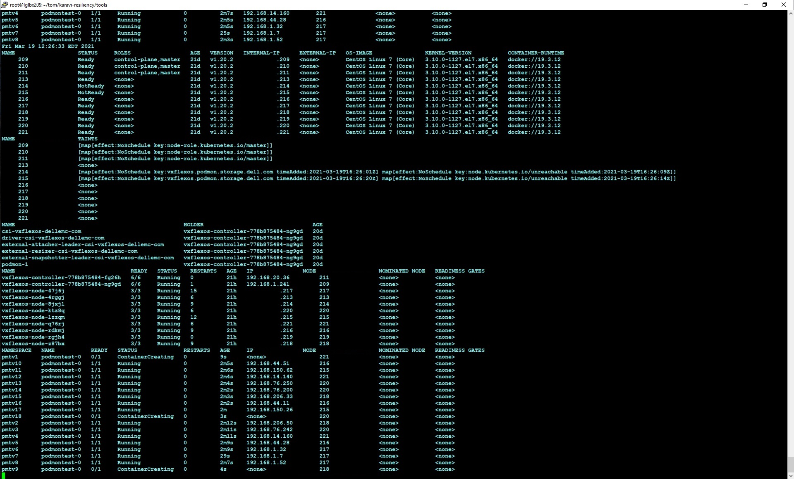
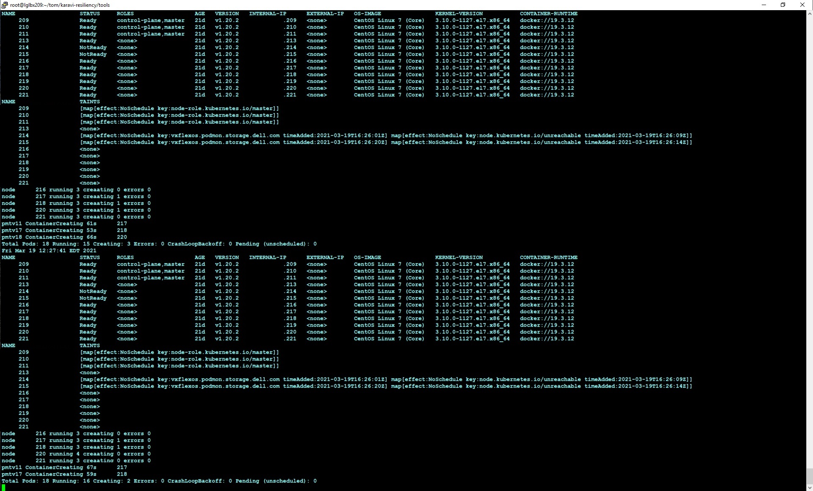

<!--
Copyright (c) 2021 Dell Inc., or its subsidiaries. All Rights Reserved.

Licensed under the Apache License, Version 2.0 (the "License");
you may not use this file except in compliance with the License.
You may obtain a copy of the License at

    http://www.apache.org/licenses/LICENSE-2.0
-->

# Reporting Problems

If you experience a problem with Karavi Resiliency it is important you provide us as with much information as possible so that we can diagnose the issue and improve Karavi Resiliency. Some tools have been provided in the _tools_ directory that will help you understand the system's state and facilitate sending us the logs and other information we will need to diagnose a problem.

## Monitoring Protected Pods and Node Status

There are two tools for monitoring the status of protected pods and nodes.

The mon.sh script displays the following information every 5 seconds:

* The date and time.
* A list of the nodes and their status.
* A list of the taints applied to each node.
* A list of the leases in the CSI drivers namespace. (Edit the script to change the driver namespace if necessary. It defaults to vxflexos as the driver namespace.)
* A list of the CSI driver pods and their status (defaults to vxflexos namespace.) 
* A list of the protected pods and their status. (Edit the script if you do not use the default podmon label key.)

For systems with many protected pods, the _monx.sh_ may provide a more usable output format. It displays the following fields every 5 seconds:

* The date and time.
* A list of the nodes and their status.
* A list of the taints applied to each node.
* A summary for each node hosting protected pods of the number of pods in various states such as the Running, Creating, and Error states. (Edit the script if you do not use the default podmon label key.)
* A list of the protected pods not in the Running state.

## Collecting and Submitting Logs

If you have a problem with podmon that you would like Dell to diagnose, please use the tools/collect_logs.sh script to collect the information we need into a tar file and submit the tar file as part of your Problem Report. Type "collect_logs.sh --help" for help on the arguments.

The script collects the following information:
* A list of the driver pods.
* A list of the protected pods.
* The podmon container logs for each of the driver pods.
* The driver container logs for each of the driver pods.
* For each namespace containing protected pods, the recent events logged in that namespace.

After successful execution of the script, it will deposit a file similar to driver.logs.20210319_1407.tgz in the current directory. Please submit that file with any Problem Report.